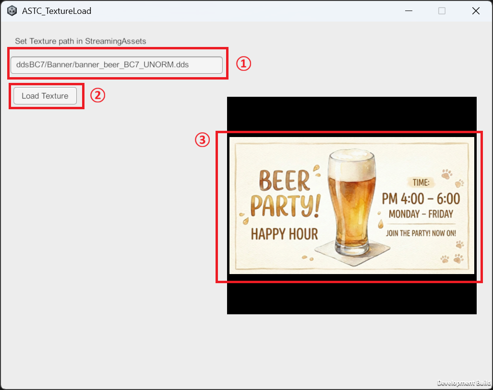
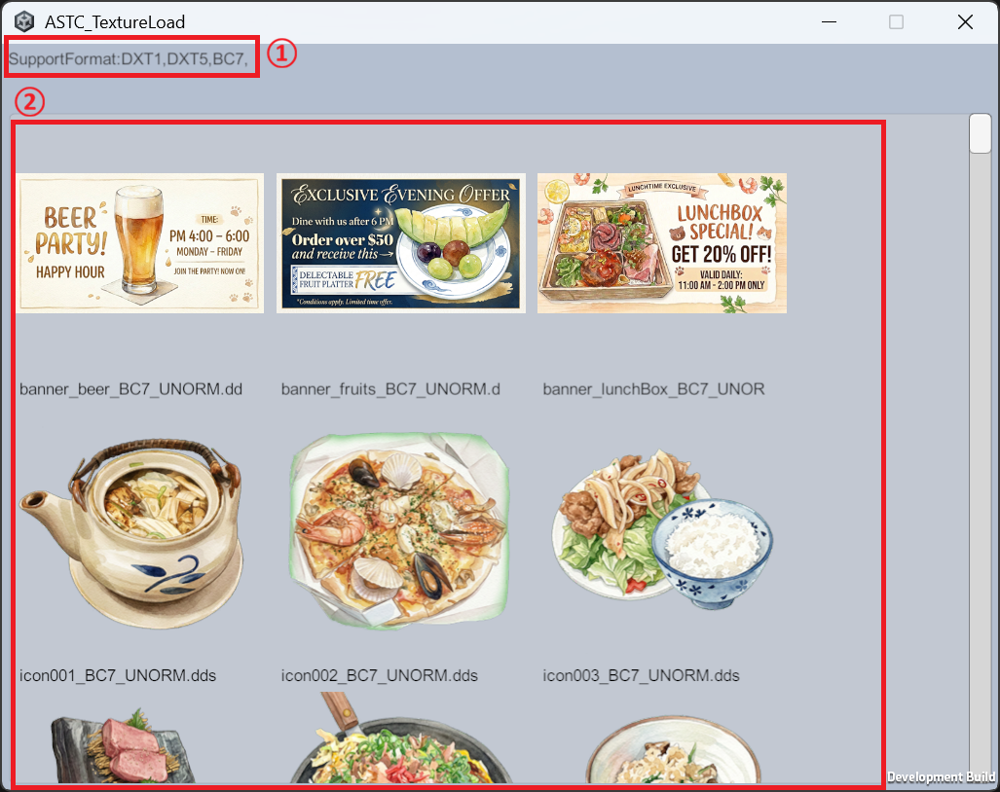
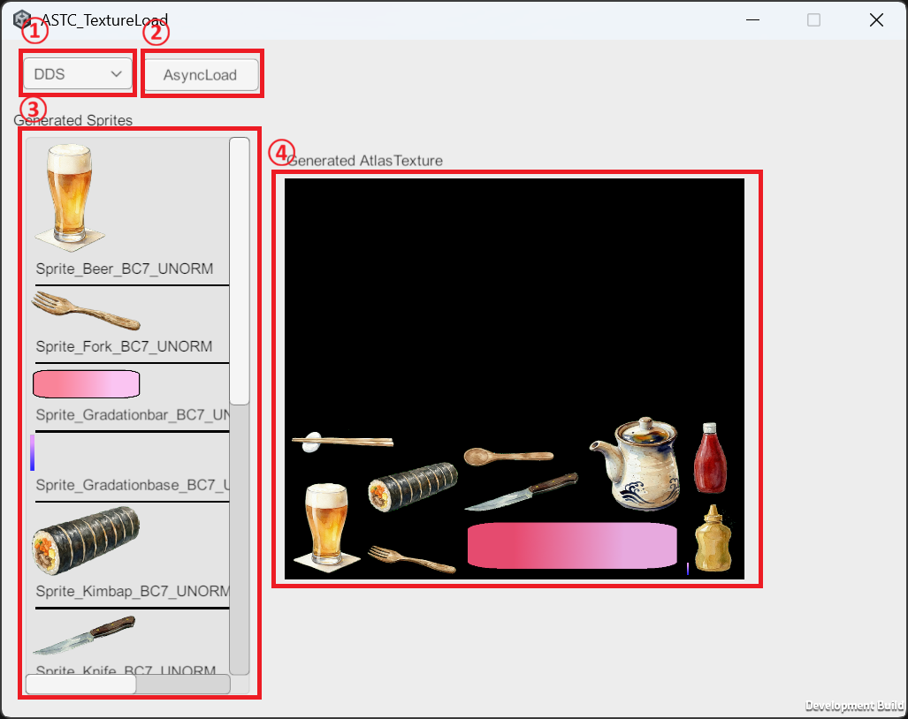
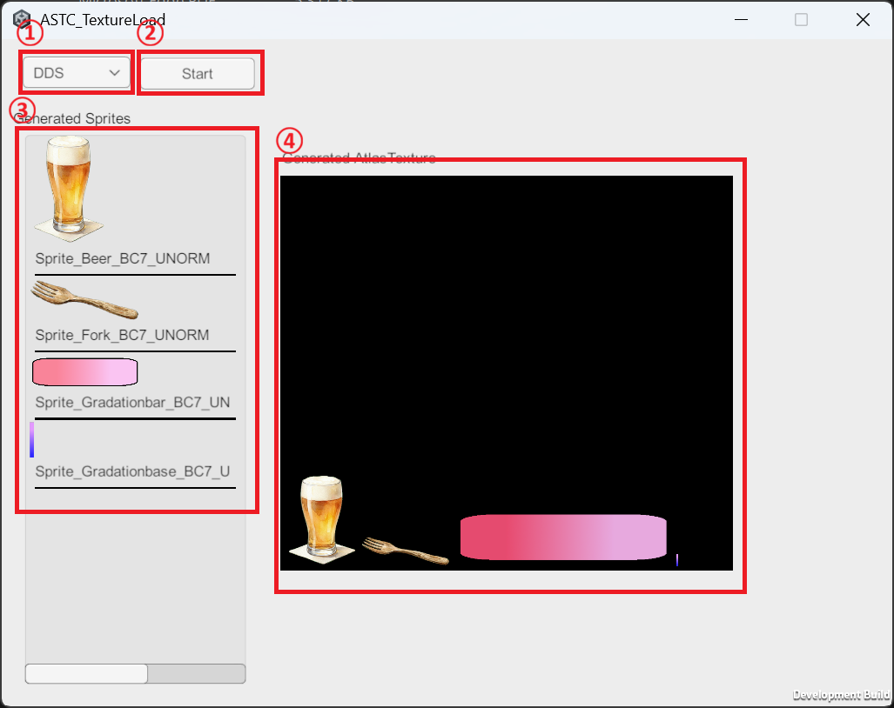
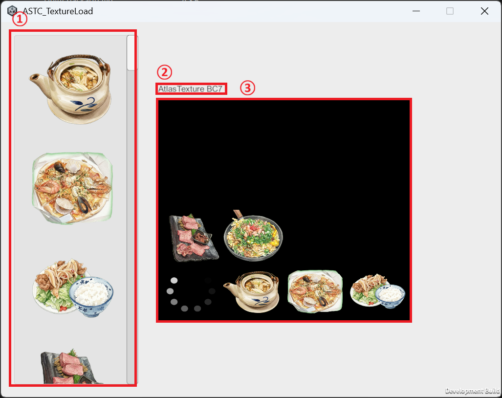

# Package同梱のサンプル

## Common StreamingAssets Importing
他のサンプルを実行する前にインポートしてください。 
インポートすると、StreamingAsset以下に他のサンプル実行に必要なサンプルをインストールします。 
Samples~/RCTP_StreamingAssetsData.unitypackage を直接インストールしても問題ありません。

## 01_SingleTextureLoad
StreamingAssets ディレクトリにある astc,ktx,ddsファイルを直接読み込むサンプルです。 

### ランタイム
 

画面解説

  
1.StreamingAssets以下にあるファイルを指定してください 
2.指定されたパスにあるTextureファイルをロードします 
3.ロードされた結果を表示します 

### Editor

## 02_TextureListInStreamingAssets

### ランタイム
StreamingAsset以下にある全ての読み込み可能な画像ファイルを読み込み、スクロールビューに表示するサンプルです。 

 

画面解説

  
1.実行中のプラットフォームがサポートしている圧縮テクスチャフォーマットを表示します 
2.StreamingAsset以下にあるTextureで読み込み可能なファイルを全て表示します 

## 03_AutoAtlasGenerate

### ランタイム
StreamingAssetsフォルダ内に配置された複数のファイルを読み込んで、Atlasテクスチャとスプライトを自動的に生成するサンプルです。 

 

画面解説

  
  
1.テクスチャファイル拡張子を指定します。ASTC/KTX/DDSの三つから選べます 
2.指定された拡張子のファイルで読み込みを開始します 
3.ファイルからロードされて作成されたSpriteの一覧です 
4.SpriteがパックされているAtlasテクスチャです 

## 04_IncrementalAtlasGeneration

### ランタイム
このサンプルは、「03_AutoAtlasGenerate」と同様の処理を行います。違いは、アトラスを段階的に生成するため、生成プロセスを確認できる点です。 

 

画面解説

  
  
1.テクスチャファイル拡張子を指定します。ASTC/KTX/DDSの三つから選べます 
2.指定された拡張子のファイルで読み込みを開始します 
3.ファイルからロードされて作成されたSpriteの一覧です 
4.SpriteがパックされているAtlasテクスチャです 

## 05_ReuseAtlasForFixedSizeImages

### ランタイム
スクロールビュー等で、多数のアイコンを表示する機能を示しています。
読み込まれたアイコンスプライトがアトラスに収まらない場合、LRU（Least Recently Used）アルゴリズムを用いて、古いスプライトが自動的に削除されます。 

 

画面解説

  
  
1.アイコン一覧が並んでいるスクロールビューです。スクロールしたら動的に読み込みを行います 
2.現在のAtlasテクスチャの圧縮フォーマットを表示します 
3.現在のAtlasテクスチャです 

## 05Alternative_UITK

### ランタイム
「05_ReuseAtlasForFixedSizeImages」のUI Toolkit版サンプルです

## 06_EncryptedDataLoad
### ランタイム
暗号化されたファイルの読み込みのサンプルです。

