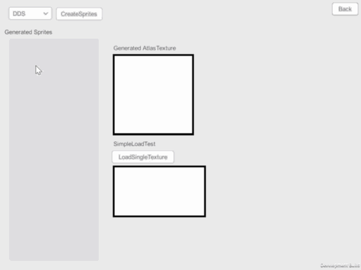
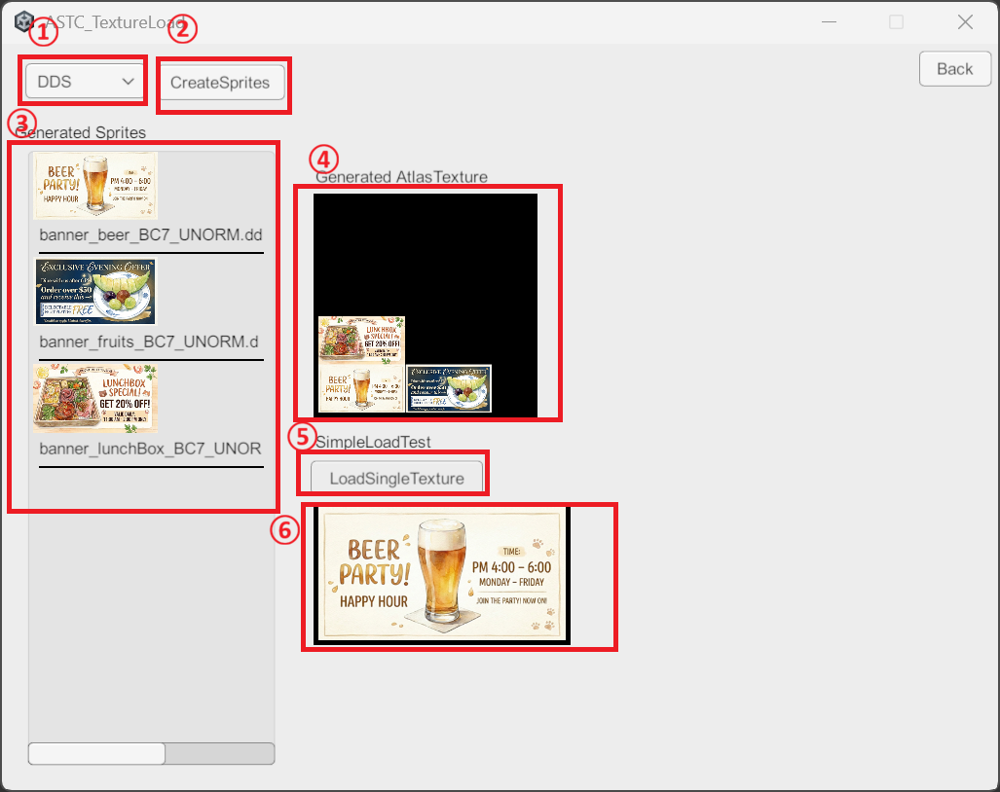

# Samples Included in the Package

## Common StreamingAssets Importing
Please import this before running other samples. 
Upon importing, the assets necessary for running other samples will be installed under the StreamingAssets folder. 
You can also install `Samples~/RCTP_StreamingAssetsData.unitypackage` directly without any issues.

## 01_SingleTextureLoad
A sample that directly loads astc, ktx, and dds files located in the StreamingAssets directory. 

### Runtime
 

UI Description

  
1. Specify a file located under StreamingAssets. 
2. Loads the Texture file at the specified path. 
3. Displays the loaded result. 

### Editor
Call it from the menu: `Samples/RuntimeCompressedTexturePacker/SingleTextureLoadSampleEditor`. 
You can verify similar behavior to the runtime directly within an EditorWindow.

## 02_TextureListInStreamingAssets

### Runtime
A sample that loads all readable image files under StreamingAssets and displays them in a ScrollView. 

 

UI Description

  
1. Displays the compressed texture formats supported by the currently running platform. 
2. Displays all readable texture files located under StreamingAssets. 

### Editor
Call it from the menu: `Samples/RuntimeCompressedTexturePacker/TextureListSampleEditor`. 
You can verify similar behavior to the runtime directly within an EditorWindow.

## 03_AutoAtlasGenerate

### Runtime
A sample that reads multiple files placed in the StreamingAssets folder and automatically generates an Atlas texture and sprites. 

 

### Editor
Call it from the menu: `Samples/RuntimeCompressedTexturePacker/AutoAtlasBuildSampleEditor`. 
You can verify similar behavior to the runtime directly within an EditorWindow.

UI Description

  
  
1. Specify the texture file extension. You can choose from ASTC, KTX, or DDS. 
2. Starts loading files with the specified extension. 
3. A list of Sprites created by loading from the files. 
4. The Atlas texture where the Sprites are packed. 

## 04_IncrementalAtlasGeneration

### Runtime
This sample performs the same process as "03_AutoAtlasGenerate". The difference is that it generates the atlas incrementally, allowing you to observe the generation process. 

 

UI Description

  
  
1. Specify the texture file extension. You can choose from ASTC, KTX, or DDS. 
2. Starts loading files with the specified extension. 
3. A list of Sprites created by loading from the files. 
4. The Atlas texture where the Sprites are packed. 

## 05_ReuseAtlasForFixedSizeImages

### Runtime
Demonstrates the functionality of displaying a large number of icons in a ScrollView or similar UI.
If the loaded icon sprites do not fit into the atlas, older sprites are automatically removed using the LRU (Least Recently Used) algorithm. 

 

UI Description

  
  
1. A ScrollView listing icons. It loads them dynamically as you scroll. 
2. Displays the compression format of the current Atlas texture. 
3. The current Atlas texture. 

## 05Alternative_UITK

### Runtime
This is the UI Toolkit version of the "05_ReuseAtlasForFixedSizeImages" sample.

### Editor
Call it from the menu: `Samples/RuntimeCompressedTexturePacker/ReuseAtlasUITKEditorSample`. 
You can verify similar behavior to the runtime directly within an EditorWindow.

## 06_EncryptedDataLoad

### Runtime
A sample for loading encrypted files. 

 

UI Description

  
  
1. Specify the texture file type. You can choose from ASTC, KTX, or DDS. 
2. Loads multiple files and creates an Atlas texture along with Sprites. 
3. Displays the generated Sprites. 
4. Displays the Atlas texture used for the loaded and generated Sprites. 
5. Single texture load. 
6. The loaded single texture. 

### Editor
Call it from the menu: `Samples/RuntimeCompressedTexturePacker/GenerateEncryptTexture/SelectTargetFile`. 
Select a file to generate an encrypted version of it. The encrypted file will be generated in the same directory as the selected file. 
 
Call it from the menu: `Samples/RuntimeCompressedTexturePacker/GenerateEncryptTexture/SelectDirectory`. 
Select a folder to find textures within it and generate encrypted versions. The encrypted files will be generated under the selected directory. 
